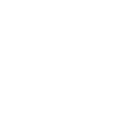

# ctrl-watchface

> [!TIP]
> `ctrl` 在中文语境中取自“唱、跳、rap、篮球”的首字母。

iKun-themed Garmin fēnix 7X Connect IQ watch face with a monochrome wake-only CTRL dance animation and glanceable metrics.

  

The animation is intentionally committed as fixed PNG frames under [`resources/drawables/images/`](resources/drawables/images/). The original GIF is not needed to build or maintain this watch face.

## Rendering Notes

The checked-in animation uses 16 two-color PNG frames, about 16 KB total. The frames are loaded once during layout and reused during updates, so each animation tick draws a single bitmap.

The README preview is generated as [`docs/preview.gif`](docs/preview.gif) for presentation only. The watch face runtime uses the PNG frames directly.

NES-style decomposition was considered, but these frames do not have a stable base layer: frame-to-frame changes usually cover most of the figure, and tile reuse is low. Base-plus-diff or tile-atlas encodings would save only a few kilobytes while replacing one bitmap draw with many line or tile draws per frame. A hand-built puppet sprite system could be smaller, but it would be a redraw of the animation rather than a faithful version of these frames.

## Development

See [`CONTRIBUTING.md`](CONTRIBUTING.md) for the repo-local Nix development shell, Connect IQ setup, simulator workflow, physical-device debugging, and Store publication notes.
